# 基于 MST 的热更新优化体验

[TOC]

## 一、主题
- MST 项目,利用热更新机制给开发带来更加舒适的体验
- 发现问题 ==> 思考、分析 ==> 解决问题
   
## 二、前言
>一些技术的认识

### 2.1、Live Reload
>早期的重载方式

<!-- LR 横向  TD 竖向, |注释| [矩形] (圆角方形) {菱形} ((圆形)) -->


```mermaid
flowchart LR;
    A[websocket服务] -->|监听| B(文件变化)
    B --> |保存变化| C[浏览器通信]
    C --> D(触发刷新)
```
    

### 2.2、HMR（hot module replacement）
>Webpack 的 Hot Reload


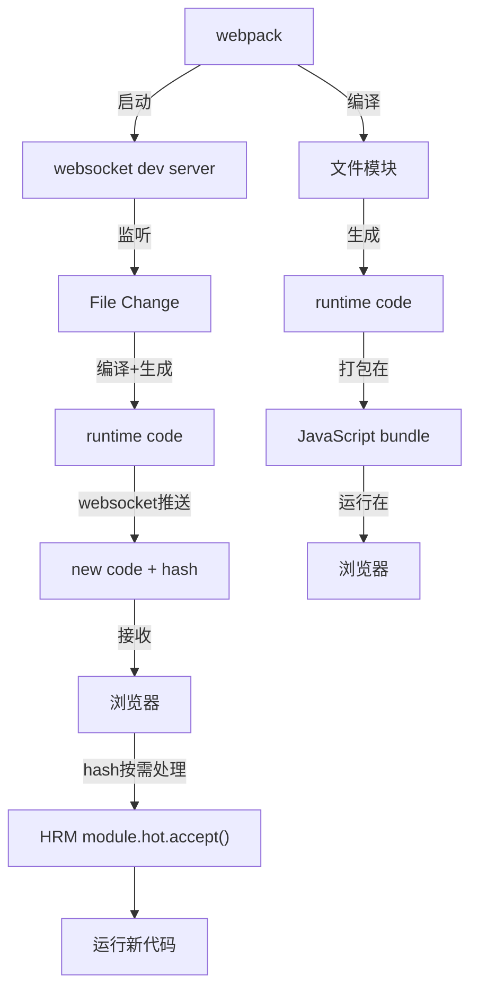
```mermaid
flowchart TD;
    A[webpack] -->|启动| B[websocket dev server];
    B --> |监听| C1[File Change];
    C1 --> |编译+生成| D1[runtime code]
    D1 --> |websocket推送| E1["new code + hash"]
    E1 --> |接收| F1[浏览器]
    F1 --> |hash按需处理| G1["HRM module.hot.accept()"]
    G1 --> H1[运行新代码]

    
    A --> |编译| C[文件模块];
    C --> |生成| D[runtime code];
    D --> |打包在| E[JavaScript bundle];
    E --> |运行在| C2[浏览器];
    
```

### 2.3、React


<details>
  <summary>
    <span>一个基本的 react 组件</span>
  </summary>
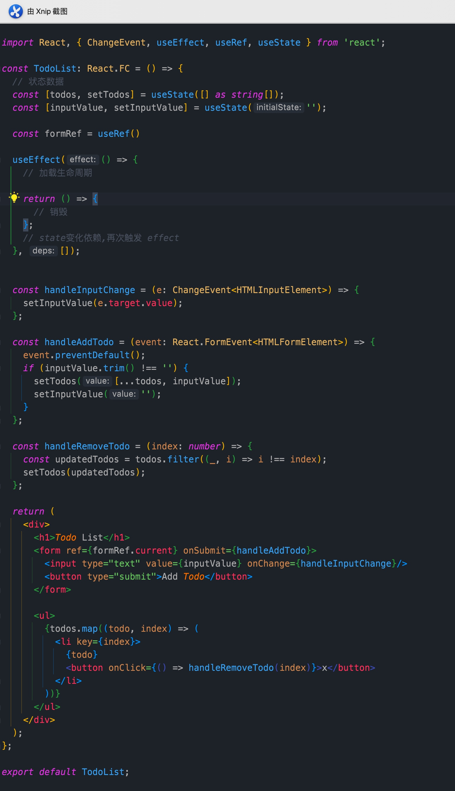
</details>

<details>
  <summary>
    <span>效果展示</span>
  </summary>

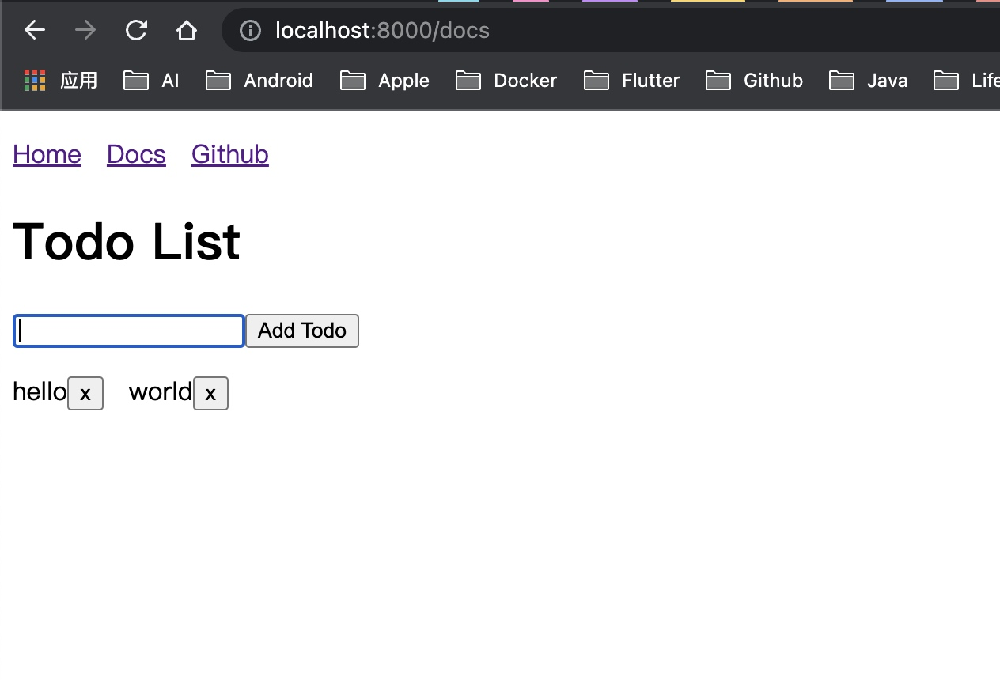
</details>


- 热更新
=> 可以在你修改代码后自动重新加载应用程序而无需手动刷新页面

    - V16 ==> React Hot Loader  18年
        - 组件
            - 改动即生效
        - state
            - 手动刷新
        - hook
            - 手动刷新
        - ts 模块 mobx、redux
            - Live Reload
    
    - V16+ ==> react refresh，19 年
        - 组件
            - 改动即生效
        - state
            - 热更新支持保存
        - hooks
            - 改动即生效
        - ts 模块 mobx、redux
            - 手动刷新


### 2.4、React Hot Loader

- 社区维护
- babel 插件, 编译阶段
- 实现
    - 依赖并监听 HMR 的变化
    - 为 react 代理组件与模块标识
    - HMR 模块变化, 负责接收并找到组件替换
    - 触发 react 的 forceUpdate()
    - 组件级别的热更新

### 2.5、React Refresh + React Refresh Webpack Plugin
> Fast Refresh

#### 2.5.1 React Refresh
- 官方开发
- 实现
    - 组件签名
        - 类型签名,描述组件的类型和结构
        - 标记签名描述组件的状态和上下文
    - 更新机制
        - 结构是否变更
            - 重新创建实例,使用之前的状态
        - 状态是否变更
            - 更新状态
    - 实现组件级别的细微更新
    - 支持 FC Component/Hooks/HOC/

#### 2.5.2 React Refresh Webpack Plugin
- webpack 插件
- 监听 HMR 机制,发送最新组件代码


### 2.6、create react app 4.0
- facebook 开发
- 4.0 实现 React Refresh + React Refresh Webpack Plugin

[热更新文档](https://www.cnblogs.com/liangyin/p/16579708.html)

### 2.7、Mobx State Tree => MST
> 状态管理工具: 将应用程序的状态抽象成可观察和可操作的树状结构，通过定义模型和动作来管理和修改状态。

<details>
  <summary>
    <span>mob 可观察</span>
  </summary>
    
    MobX 实现数据的可观察性是通过 JavaScript 的特性 Proxy 来实现的。
    当你使用 MobX 定义可观察的数据时，MobX 会使用 Proxy 对这些数据进行包装，并建立一个与原始数据对象相连的代理对象。
    代理对象拦截了对数据的访问和修改操作，并在其中注入了对观察者的通知机制。
    
    当你访问可观察数据的属性时，代理对象会捕获这个访问操作，并将其标记为依赖关系。
    这意味着当属性的值发生变化时，MobX 可以追踪到所有依赖于该属性的观察者，并自动通知它们进行更新。
    
    同样地，当你修改可观察数据的属性时，代理对象会拦截该修改操作，并通知所有相关的观察者进行相应的更新。
    这使得你可以直接修改可观察数据，而不需要手动调用通知方法来告知观察者进行更新。
    
    Proxy 是 JavaScript 的一种特殊对象，它可以拦截并自定义对象的基本操作，如属性访问、属性修改、函数调用等。
    通过使用 Proxy，MobX 能够实现对数据的透明拦截和观察，从而实现了数据的可观察性。
    
    需要注意的是，Proxy 并不是在所有环境下都被完全支持，特别是在一些旧的浏览器中。
    在不支持 Proxy 的环境下，MobX 会尝试使用其他手段来实现数据的可观察性，如使用 Object.defineProperty。
</details>

- MST 特点
    - 可观察的状态,基于 mobx
    - 树状结构
    - 强类型模型
    - 事务性更新

- 简单使用
    - 定义模型
    - 组件 observer
    - 创建实例
    - 使用实例

**<span style="color:red">MST 案例:</span>**

<details>
  <summary>
    <span style="color:red">1. 模型定义</span>
  </summary>

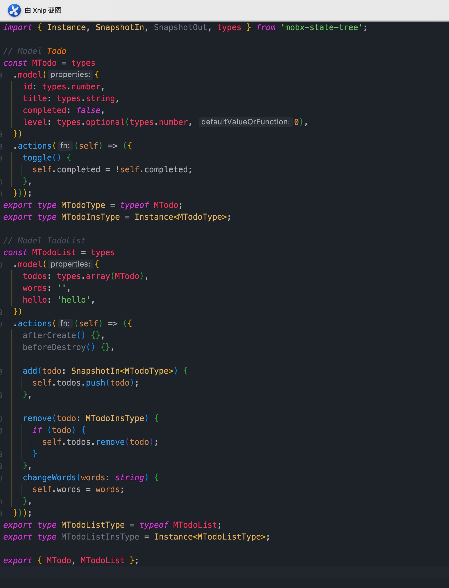

</details>

<details>
  <summary>
    <span style="color:red">2. 使用</span>
  </summary>

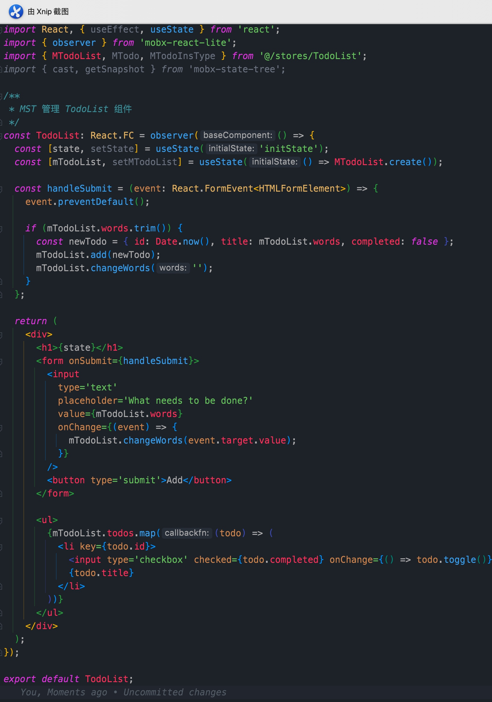

</details>


<details>
  <summary>
    <span style="color:red">3. 效果</span>
  </summary>

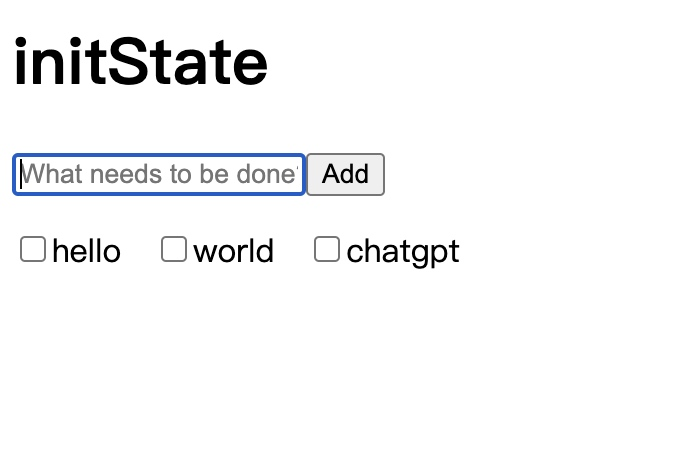

</details>

## 三、正文

### 3.1、发现问题

#### 3.1.1、问题
在自己开发和跟同事的交流过程中发现
普通react组件中hooks、state、UI改动后,Hot Reload会立马生效
**ts 模块、mst model 的变量 / Action 函数变动,需要手动刷新页面**


<details>
  <summary>
    <span style="color:red">1-1. hello的值由 hello 变成hello world
    </span>
  </summary>

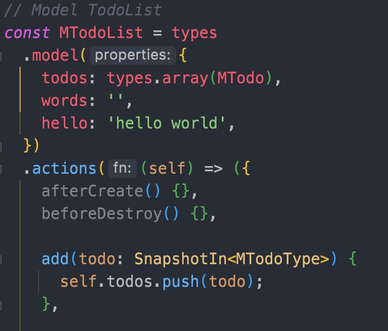

</details>


<details>
  <summary>
    <span style="color:red">1-2. 组件上表现出来的还是 hello</span>
  </summary>


</details>


<details>
  <summary>
    <span style="color:green">2-1. action 每次添加的时候,增加一个兄弟</span>
  </summary>
  
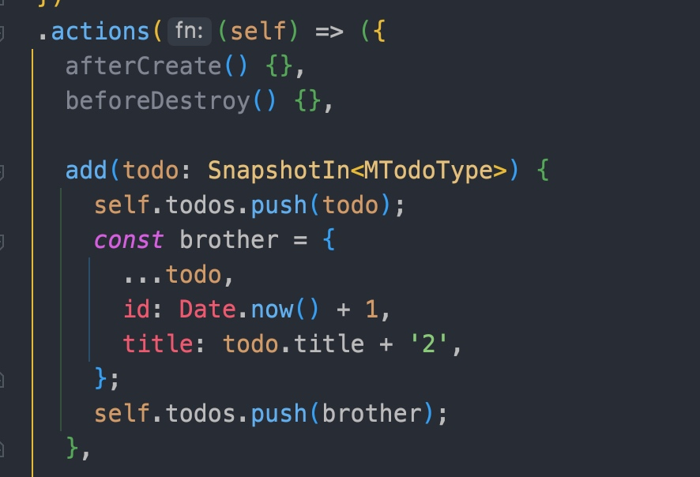
</details>


<details>
  <summary>
    <span style="color:green">2-2. 组件上表现出来的还是只会加一个</span>
  </summary>
  
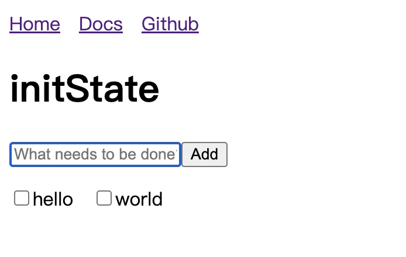
</details>

<details>
  <summary>
    <span style="color:yellow">3-1. model 定义新增 keyword 字段'xxx'</span>
  </summary>

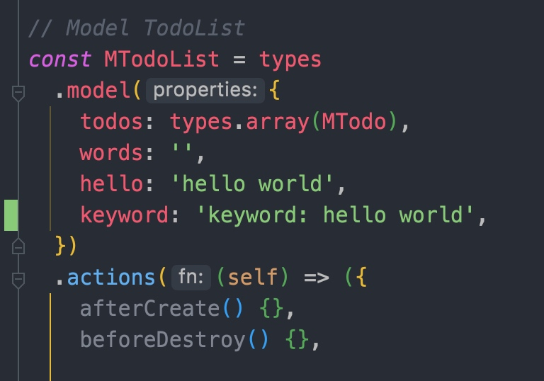
</details>

<details>
  <summary>
    <span style="color:yellow">3-2. 组件引用其值并未展示</span>
  </summary>


</details>

一旦刷新,界面的数据就会丢失,复杂页面或者复杂流程下,重现刚刚改动之前的场景会变得异常费劲.

<span style="color:red">==> 疑问: 是否可以实现，ts model上述变化后，不用刷新页面，也直接生效？(每次刷新导致之前添加的数据都丢失)<span/>           

#### 3.1.2、来源, 如何发现
- 自身体验
    - 云平台管理端，非常多的表单，非常复杂：联动、请求、分步
    - 开发时改动 model，得手动刷新，重新操作表单到刚刚的场景
        - 给一些变量加假的 initValue
        - 硬着头皮repeat
    
- 团队交流
    - 做需求、改bug,一起研究
    - 复现问题步骤、场景

- 总结
    - 来源感知
        - 开发不顺手
        - 前置依赖固定
        - 花时间很长
        - 重复性很高
    - 多沟通
        - A 见 B 学
        - B 见 A 学


### 3.2、思考和分析

<details>
  <summary>
    <span style="color:red">先看下我们 demo 的组件结构</span>
  </summary>
  
  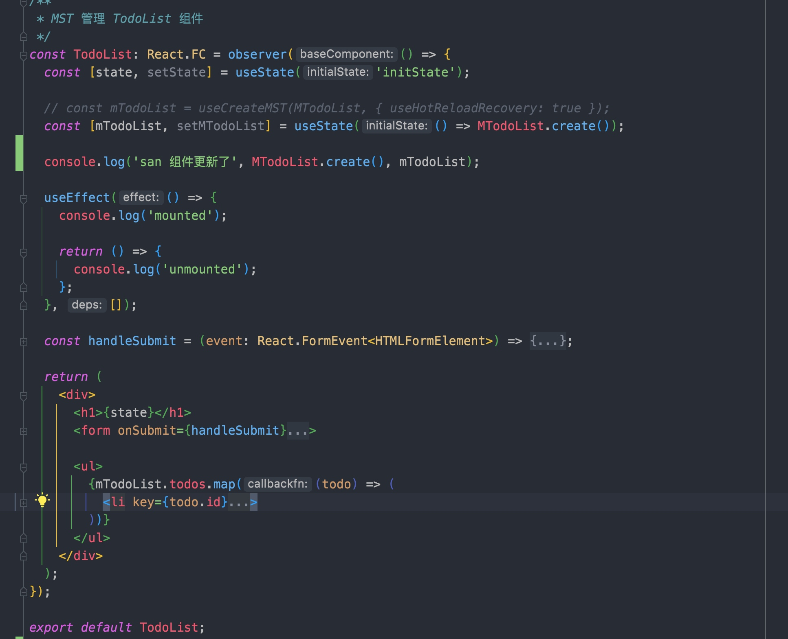
</details>

<details>
  <summary>
    <span style="color:red">页面展示</span>
  </summary>
  
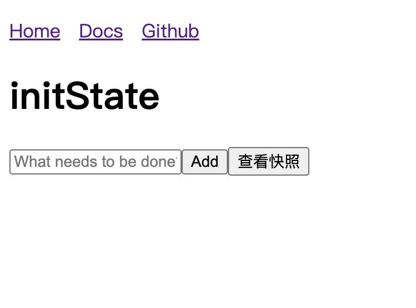
</details>


#### 3.2.1、Why?
- model 代码是否更新

<details>
  <summary>
    <span style="color:red">HMR已经推送</span>
  </summary>

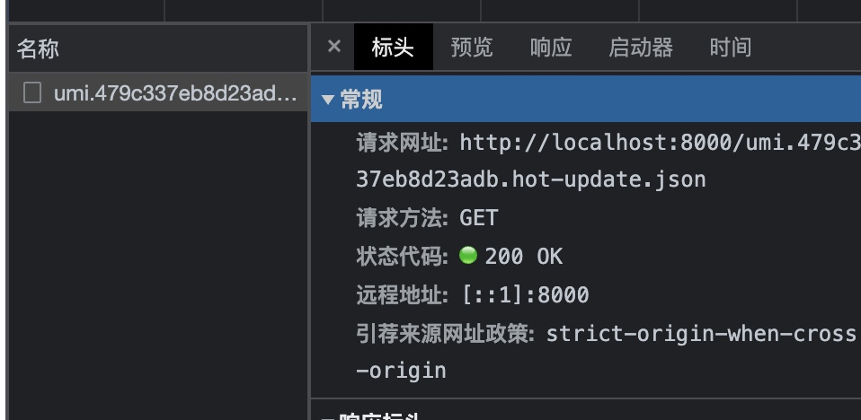
</details>


<details>
  <summary>
    <span style="color:red">代码已经更新</span>
  </summary>

  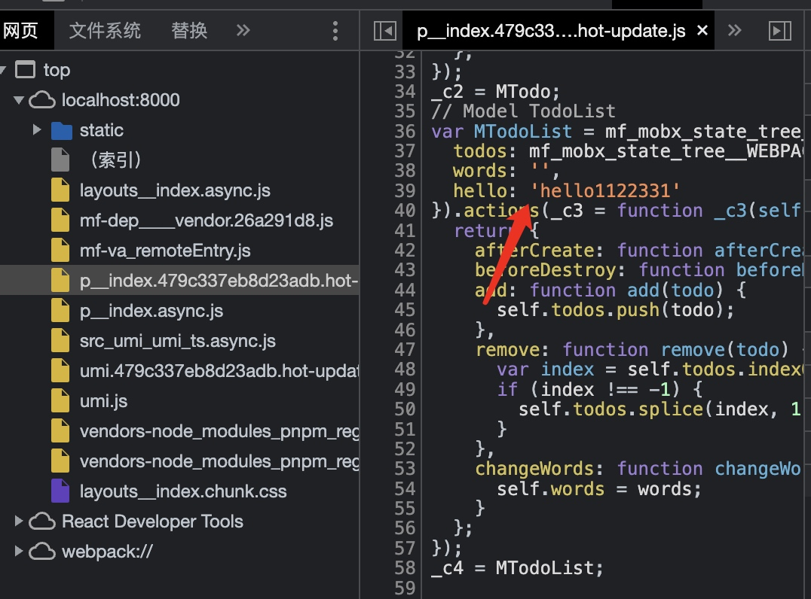
</details>

    
- 组件是否识别最新代码
在组件代码添加 log

<details>
  <summary>
    <span style="color:red">组件代码 log</span>
  </summary>

  
</details>

热更新前后 log 现象:
<details>
  <summary>
    <span style="color:red">先添加 2 个 todo</span>
  </summary>

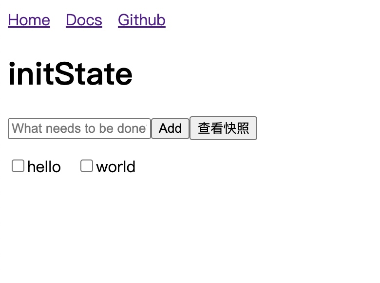
</details>

<details>
  <summary>
    <span style="color:red">触发后 log 现象</span>
  </summary>

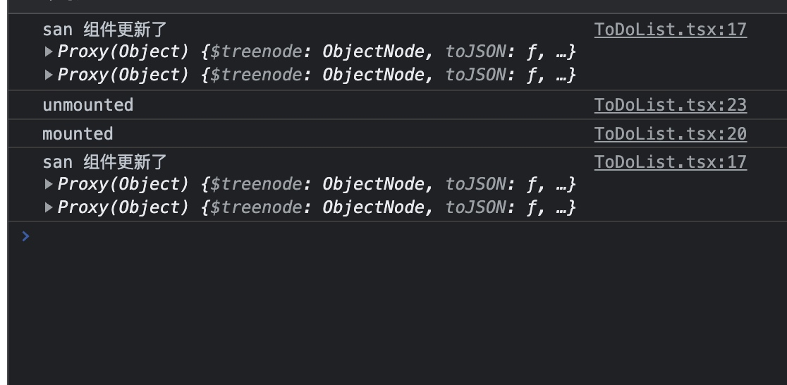
</details>

<details>
  <summary>
    <span style="color:red">具体细节</span>
  </summary>
  
  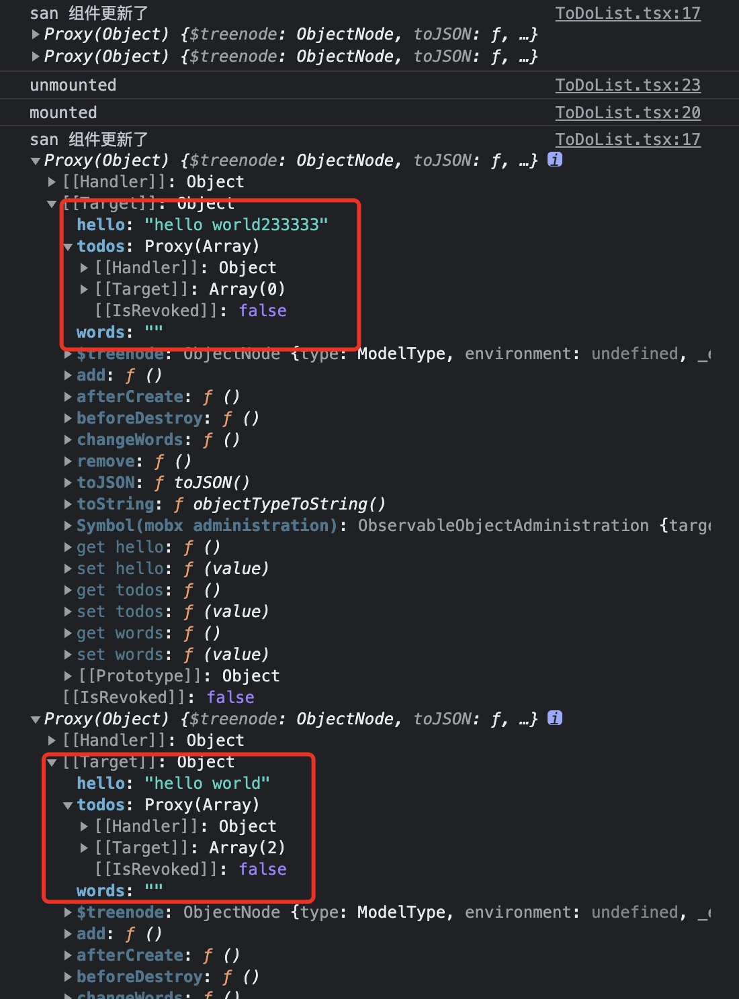

</details>

**可知: 热更新会触发组件的 刷新/卸载/挂载/更新, 组建了可拿到 MTodoList 最新的定义.热更新正常过程完成
1.如果重新创建实例,那么数据状态就会丢失,变量会拿到最新的(函数也是)
2.如果不重新创建实例,那么数据状态还是之前的,但是变量不会更新,新函数也不会生效
3.如果创建实例的操作放在外面,那么数据依状态旧会被丢失(每次都是新对象)**

- 思考,代码为什么没生效
**由于 useState 的 initial 函数只运行一次,并且在热更新过程中 state->mTodoList 被保存,
这是 react-refresh 实现的功能,是为了帮助我们提升开发效率的.恰恰导致创建 mTodoList 的MTodoList 模型定义没有发生改变,从而使得改动未生效**

- 理论上是否可以实现
    - 拿到新引用√
    - 记录旧状态√
    - 判断热更新√
    - 创建新实例√
    - 恢复旧状态√


#### 3.2.1、How?

- 1. 如何使得开发中,每一个定义的 model 都能享受这个效果 ==> 统一创建?
    - 创建一个 hook,hook 内部监听热更新并实现了该功能,hook 返回需要的实例
    - hook 的参数为 model 定义和一些额外自定义配置
        - 思想原理: model 的热更新会触发引用 model 的那个组件的热更新(react-refresh),hook 就会再次运行,而且可拿到最新定义,进行一些骚操作

```ts    
    type MSTCreationOptions = {
      useHotReloadRecovery?: boolean;
    };
    useCreateMSTInstance<T extends IModelType<any, any>>(ModelDef: T, options: MSTCreationOptions): Instance<T>
    
```

**拿到新引用 Get**
    
- 2. 实现创建实例的功能,在非热更新的状态下正常使用

```ts
    useCreateMSTInstance(ModelDef, options) {
        const [state] = useState<ModelCreationType<T>>(() => {
            const instance = ModelDef.create();
            return instance;
        });
        return state
    }
```
         
                   
**记录旧状态 Get**         
         
- 3. 判断热更新
>完成热更新,看 log 知道组件先卸载再挂载,代码运行阶段如何得知?

**production mode**: 一定不会触发,因为代码打包完运行一般是不会发生变化的
**develop mode**: 第一次运行不会触发,组件自己更新,状态触发更新均不会触发,热更新导致的第2345次运行才会触发.

**反过来想: 是因为自己开发修改 model 定义,触发了热更新,导致了 ModelDef 不一致.**
==> 记录的初始 ModelDef 和hook再次运行的 ModelDef 对比,不一致则是热更新所致

```ts
    // 既然 useState 的 initial 函数只运行一次,初始 ModelDef 直接就可以安稳记录
    useCreateMSTInstance(ModelDef, options) {
         const [state] = useState<ModelCreationType<T>>(() => {
            const instance = ModelDef.create();
            return {
                instance,
                def: ModelDef,
            }
         });

        // 组件每次刷新hook 这里都会运行,检查是否热更新导致 ModelDef 变化
        if (isDev() && state.def !== ModelDef) {
            
        }
   
        return state.instance
    ]
```
**判断热更新 Get**
    

- 创建新的实例,取出之前保存的实例和状态

```ts
    useCreateMSTInstance(ModelDef, options) {
        const [state] = useState<ModelCreationType<T>>(() => {
            const instance = ModelDef.create();
            return {
                instance,
                def: ModelDef,
            }
         });
        
        // 组件每次刷新hook 这里都会运行,检查是否热更新导致 ModelDef 变化
        if (isDev() && state.def !== ModelDef) {
            let snapShot;
            if (options.useHotReloadRecovery) {
            // 取出当前 state 里的实例 state.instance
              const memo: any = getSnapshot(state.instance);
              snapShot = { ...memo };
            }
            state.instance = ModelDef.create(snapShot);
            
            state.def = ModelDef;
        }
    }
```

**创建新实例 Get**
**恢复旧状态 Get**


- 总结
    - 复现问题
        - 精确定位
        - 缩小问题
        - 明确目标
    - 积累调试技巧
    - 多问为什么
        - 搞明白
    - 将问题拆分
        - 化整为零
        - 逐个击破
    
    
### 3.3、解决问题

1. 创建 hook
    
    <details>
      <summary>
        <span style="color:red">完整代码</span>
      </summary>
        
    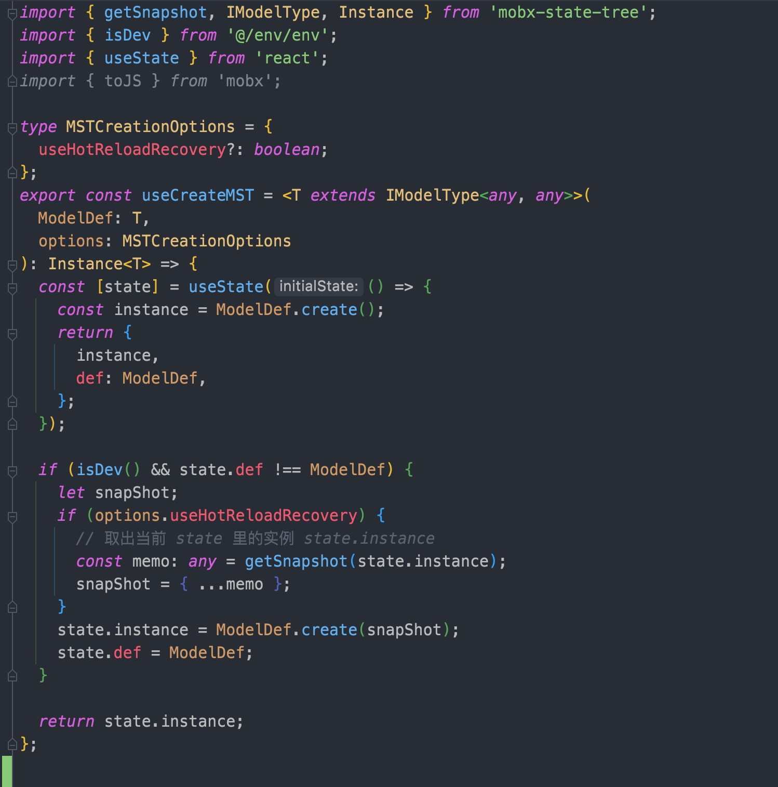
    </details>
    
    
2. 使用 hook

    <details>
      <summary>
        <span style="color:red">组件使用 hook 创建实例</span>
      </summary>
    
    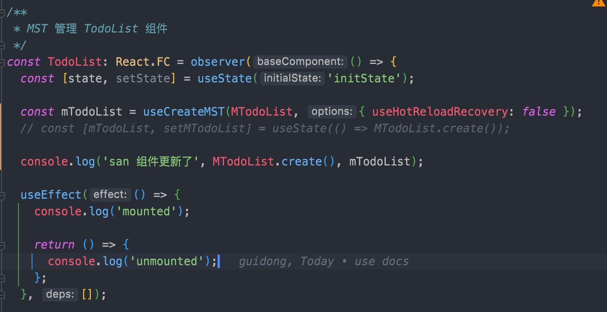
    </details>


3. 验证

    - 在增加 todo 的时候,每次会同时增加一个兄弟(就是会一次加 2 个)
    
    [手动视频演示](../static/resources/mst-docs/video-1.mp4)
    <video controls>
      <source src="../static/resources/mst-docs/video-1.mp4" type="video/mp4">
    </video>

    - 给定义的 MTodoList 模型,增加一个字段 keyword 直接在组件里引用

    [手动视频演示](../static/resources/mst-docs/video-2.mp4)
    
    - 哪怕写错代码导致界面报错,然后更改正确代码,依旧支持状态恢复

    [手动视频演示](../static/resources/mst-docs/video-3.mp4)
     
在开发中:直接享受丝滑开发体验
**再也不用刷来刷去**
**再也不用造假数据**
**再也不用烦恼更改代码重现场景**
**复杂场景更加能体现优雅**
**(增强版有更多特性)**
    

- 总结
    - 重理一遍
        - 巩固思考
        - 加深印象

### 3.4、思考拓展

- 恢复开关
    - 热更新时是否只需要享受最新代码,而不需要恢复状态
    - useHotReloadRecovery 实现

- 微持久缓存
    - 使用 model 的组件卸载了,再次挂载后,依然可以恢复,只要 App 不刷新重载
    - modelCacheMap<string, object>
    - 场景: 有的组件动态加载,开发过程中会来回切换
    
- 动作感知
    - 在开发阶段,通过 model 的 $useCache 判断是否是由热更新恢复而来的数据
    - 创建新实例的时候,如果是恢复数据,增加 $useCache 字段设置 true
    - 场景: 某接口上来就要调,每次都要获取最新的值,所以即便热更新状态在,但是该接口还得重调用,此时就可以使用该变量(当然直接上来调)

- 全局类型
    - 有的 model,跨组件共享,跨路由共享,不能在函数组件里创建实例
    - 在定义完 model 的时候就得创建
    - 如何实现
        - 不需要重新创建
        - 已经是新的实例
        - 已经存了旧的实例
        - 可以直接取之前的状态恢复
      
- 自动销毁
    - 组件/路由卸载的时候销毁模型实例,从而实现内存优化

- 挂载到 reduxdevtools
    - mst 中间件
    - 再也不用 log 排查

- 其他可能需要的统一性处理操作.etc.

### 3.5、演示

>感受舒服的 react + mst + fast-refresh + redux-dev-tool

[手动演示视频](../static/resources/mst-docs/video-full.mp4)


最后感谢 ChatGPT 对本次分享提供的 demo code 支持.


